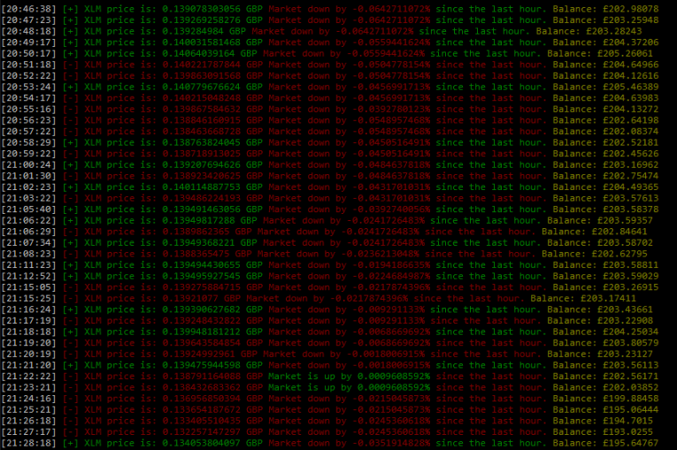

# Coinbase Monitor
> Coinbase cryptocurrency price monitor.

[](https://www.python.org/downloads/)

Simple cryptocurrency price monitor written in python using the Coinbase API.



## Installation

OS X & Linux:

```sh
git clone https://github.com/rootsh3l1/coinbase-api-monitor.git && cd coinbase-api-monitor
```

Windows:

```sh
Coming soon...
```

## Usage example

Once you run the program, you'll get chose from the available cryptocurrencies, you will then enter the amount of coins you have so you can track your current balance, and finally enter the refresh rate you prefer (personally recommend 10s to avoid any sort of rate-limit/ban).


## Deployment setup

Describe how to install all development dependencies and how to run an automated test-suite of some kind. Potentially do this for multiple platforms.

```sh
pip3 install -r requirements.txt
python3 monitor.py
```

## Release History


* 0.1.0 - First release
## Meta

Social – [@null0048](https://twitter.com/null0048)

Distributed under the [AGPL-3.0](https://github.com/rootsh3l1/coinbase-api-monitor/blob/main/LICENSE) license. See ``LICENSE`` for more information.

[https://github.com/rootsh3l1/coinbase-api-monitor](https://github.com/rootsh3l1)

## Contributing

1. Fork it (<https://github.com/rootsh3l1/coinbase-api-monitor/fork>)
2. Create your feature branch (`git checkout -b feature/fooBar`)
3. Commit your changes (`git commit -am 'Add some fooBar'`)
4. Push to the branch (`git push origin feature/fooBar`)
5. Create a new Pull Request
